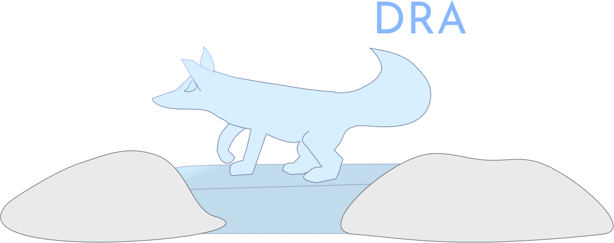

## Project Overview

**Tundra** is an operating system evironment which intends to provide an **infinitly portable** and **highly customizable** experience to both users and developers
via its **modular approach** to operating system design. Tundra is not a compatbility layer which to build your app on but instead as the ***"glue"*** between 
various different compatibility layers for systems and devices. 

## Current Status: Work in Progress

Please note that **Tundra is currently under active development and is not yet functional.** Work is diligently progressing on core components; however, at this time:

* There is **no official build system** in place.
* There is **no defined contribution process**.

Your interest in Tundra is appreciated. If you've found this repository, please check back periodically for updates on its progress.

## Currently Working On

- Creating working prototypes of the various systems and standards
- Designing the various systems and stardards

## Contact

For any inquiries or to follow the project's journey, please feel free to **watch this repository**.
